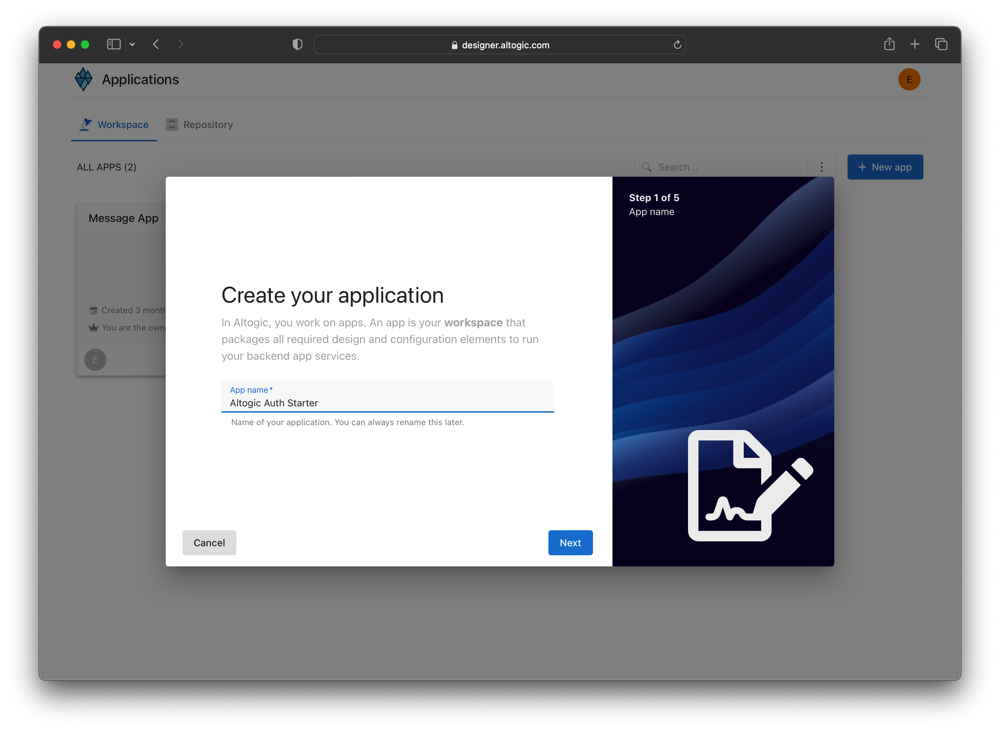
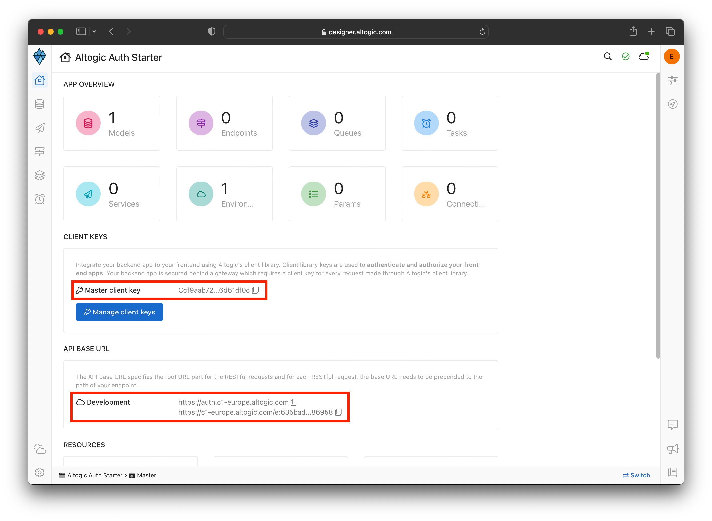
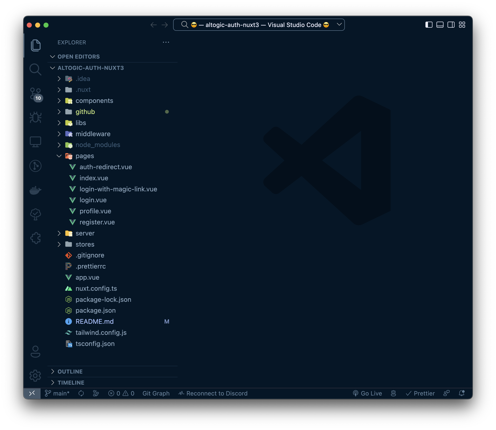
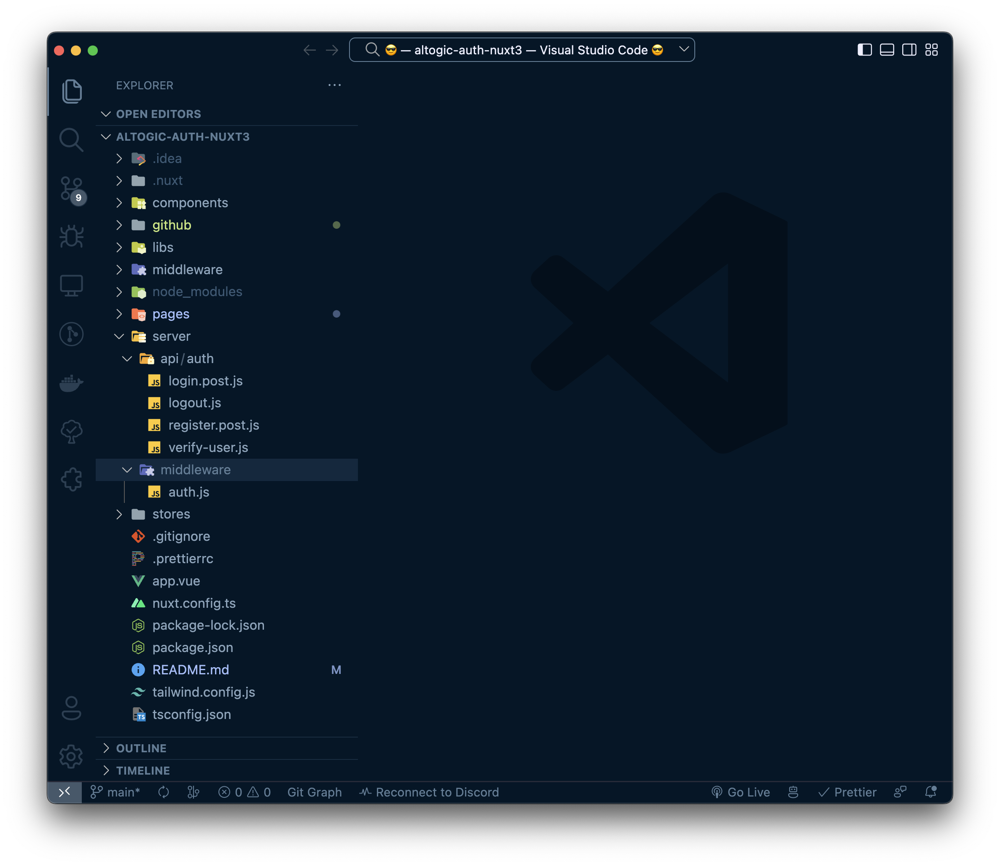
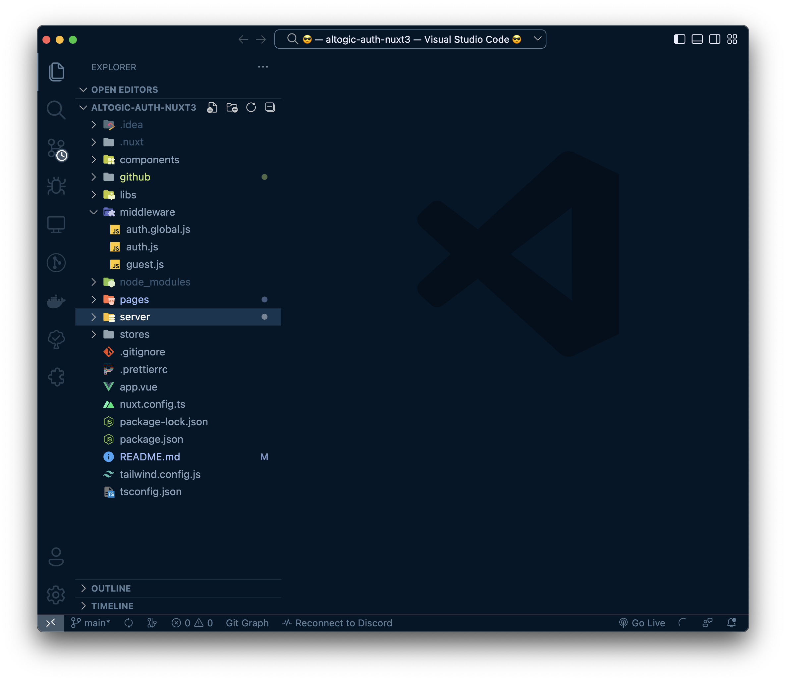

# Authentication with Nuxt 3 & Altogic

## Introduction
**Altogic** is a Backend as a Service (BaaS) platform and provides a variety of services in modern web and mobile development. Most of the modern applications using React or other libraries/frameworks require to know the identity of a user. And this necessity allows an app to securely save user data and session in the cloud and provide more personalized functionalities and views to users.

Altogic has an Authentication service that integrates and implements well in JAMstack apps. It has a ready-to-use Javascript client library, and it supports many authentication providers such as email/password, phone number, magic link, and OAuth providers like Google, Facebook, Twitter, Github, etc.,

In this tutorial, we will implement email/password authentication with Vue.js and take a look how as a Vue developer we build applications and integrate with Altogic Authentication.

After completion of this tutorial, you will learn:

* How to create sample screens to display forms like login and signup.
* How to create a home screen and authorize only logged-in users.
* How to create different routes using the vue-router.
* How to create an authentication flow by conditionally rendering between these pages whether a user is logged-in or not.
* How to authenticate users using magic link
* How to update user profile info and upload a profile picture
* And we will integrate Altogic authentication with the email/password method.

If you are new to Nuxt 3 applications, this tutorial is definitely for you to understand the basics and even advanced concepts.


## Prerequisites
* Altogic account (if you have not one yet, you can create an account by sign-in up to **Altogic**)
* Familiarity with the command line
* Any text editor or IDE (WebStorm, VsCode, Sublime, Atom, etc.)
* Basic knowledge of Javascript
* Basic knowledge of Nuxt 3

## Creating an Altogic App
We will use Altogic as a backend service platform, so let’s visit [Altogic Designer](https://designer.altogic.com/) and create an account.


After creating an account, you will see the workspace where you can access your apps.

Click + New app and follow the instructions;

1. In the App name field, enter a name for the app.
2. Enter your subdomain.
3. Choose the deployment location.
4. And select your free execution environment pricing plan.



Then click Next and select Basic Authentication template. This template is creates a default user model for your app which is required by [Altogic Client Library](https://github.com/altogic/altogic-js) to store user data and manage authentication.

Then click Next and select Basic Authentication template. This template is based on session authentication and highly recommended to secure your apps.


Then click Next to confirm and create an app.

Awesome! We have created our application; now click/tap on the **newly created app to launch the Designer.**

> This is the only configuration we need to do in Altogic Designer. In order to access the app and use the Altogic client library, we should get envUrl and clientKey of this app.
Click the **Home** icon at the left sidebar to copy the envUrl and clientKey.



Once the user created successfully, our Vue.js app will route the user to the Verification page, and a verification email will be sent to the user’s email address. When the user clicks the link in the mail, the user will navigate to the redirect page to grant authentication rights. After successfully creating a session on the Redirect page, users will be redirected to the Home page.

## Quick Tip
> If you want, you can deactivate or customize the mail verification from **App Settings -> Authentication** in Logic Designer.

## Create a Nuxt 3 project
Make sure you have an up-to-date version of Node.js installed, then run the following command in your command line
```bash
npx nuxi init altogic-auth-nuxt3
```
Open altogic-auth-nuxt3 folder in Visual Studio Code:
```bash
code altogic-auth-nuxt3
```
Install the dependencies:
```bash
npm install altogic pinia
```

## Create Routes

Nuxt has built-in file system routing. It means that we can create a page by creating a file in the **pages/** directory.

Let's create some views in **pages/** folder as below:
* index.vue
* login.vue
* register.vue
* profile.vue
* login-with-magic-link.vue
* auth-redirect.vue



### Replacing pages/index.vue with the following code:
```vue
<script setup>
definePageMeta({
    middleware: ['guest'],
});
useHead({
    title: 'Altogic Auth Sample With Nuxt3',
});
</script>

<template>
    <div class="flex items-center justify-center gap-4 h-screen">
        <NuxtLink class="border px-4 py-2 font-medium text-xl" to="/login-with-magic-link"
            >Login With Magic Link</NuxtLink
        >
        <NuxtLink class="border px-4 py-2 font-medium text-xl" to="/login">Login</NuxtLink>
        <NuxtLink class="border px-4 py-2 font-medium text-xl" to="/register">Register</NuxtLink>
    </div>
</template>

```

### Replacing pages/login.vue with the following code:
```vue
<script setup lang="ts">
import { useAuthStore } from '~/stores/useAuth';

const router = useRouter();
const auth = useAuthStore();
const email = ref('');
const password = ref('');
const errors = ref(null);
const loading = ref(false);

definePageMeta({
    middleware: ['guest'],
});
useHead({
    title: 'Login',
});

async function loginHandler() {
    loading.value = true;
    errors.value = null;
    const { user, errors: apiErrors } = await $fetch('/api/auth/login', {
        method: 'POST',
        body: JSON.stringify({
            email: email.value,
            password: password.value,
        }),
    });
    loading.value = false;
    if (apiErrors) {
        errors.value = apiErrors;
    } else {
        auth.setUser(user);
        router.push('/profile');
    }
}
</script>

<template>
    <section class="flex flex-col items-center justify-center h-96 gap-4">
        <form @submit.prevent="loginHandler" class="flex flex-col gap-2 w-full md:w-96">
            <h1 class="self-start text-3xl font-bold">Login to your account</h1>

            <div v-if="errors" class="bg-red-600 text-white text-[13px] p-2">
                <p v-for="(error, index) in errors.items" :key="index">
                    {{ error.message }}
                </p>
            </div>

            <input v-model="email" type="email" placeholder="Type your email" required />
            <input v-model="password" type="password" placeholder="Type your password" required />
            <div class="flex justify-between gap-4">
                <NuxtLink class="text-indigo-600" to="/register">Don't have an account? Register now</NuxtLink>
                <button
                    :disabled="loading"
                    type="submit"
                    class="border py-2 px-3 border-gray-500 hover:bg-gray-500 hover:text-white transition shrink-0"
                >
                    Login
                </button>
            </div>
        </form>
    </section>
</template>
```

### Replacing pages/login-with-magic-link.vue with the following code:
```vue
<script setup lang="ts">
import altogic from '~/libs/altogic';

const successMessage = ref('');
const loading = ref(false);
const email = ref('');
const errors = ref(null);

definePageMeta({
    middleware: ['guest'],
});
useHead({
    title: 'Login with magic link',
});

async function loginHandler() {
    loading.value = true;
    errors.value = null;
    const { errors: apiErrors } = await altogic.auth.sendMagicLinkEmail(email.value);
    loading.value = false;
    if (apiErrors) {
        errors.value = apiErrors;
    } else {
        email.value = '';
        successMessage.value = 'Email sent! Check your inbox.';
    }
}
</script>

<template>
    <section class="flex flex-col items-center justify-center h-96 gap-4">
        <form @submit.prevent="loginHandler" class="flex flex-col gap-2 w-full md:w-96">
            <h1 class="self-start text-3xl font-bold">Login with magic link</h1>

            <div v-if="successMessage" class="bg-green-600 text-white text-[13px] p-2">
                {{ successMessage }}
            </div>

            <div v-if="errors" class="bg-red-600 text-white text-[13px] p-2">
                <p v-for="(error, index) in errors.items" :key="index">
                    {{ error.message }}
                </p>
            </div>

            <input v-model="email" type="email" placeholder="Type your email" required />
            <div class="flex justify-between gap-4">
                <NuxtLink class="text-indigo-600" to="/register">Don't have an account? Register now</NuxtLink>
                <button
                    :disabled="loading"
                    type="submit"
                    class="border py-2 px-3 border-gray-500 hover:bg-gray-500 hover:text-white transition shrink-0"
                >
                    Send magic link
                </button>
            </div>
        </form>
    </section>
</template>
```

### Replacing pages/register.vue with the following code:
```vue
<script setup lang="ts">
import { useAuthStore } from '~/stores/useAuth';

const auth = useAuthStore();
const router = useRouter();

const email = ref('');
const name = ref('');
const password = ref('');
const errors = ref(null);
const isNeedToVerify = ref(false);
const loading = ref(false);

definePageMeta({
    middleware: ['guest'],
});
useHead({
    title: 'Register',
});

async function registerHandler() {
    loading.value = true;
    errors.value = null;
    const {
        user,
        errors: apiErrors,
        session,
    } = await $fetch('/api/auth/register', {
        method: 'POST',
        body: JSON.stringify({
            email: email.value,
            password: password.value,
            name: name.value,
        }),
    });
    if (apiErrors) {
        errors.value = apiErrors;
        return;
    }
    email.value = '';
    password.value = '';
    name.value = '';

    if (!session) {
        isNeedToVerify.value = true;
        return;
    }

    auth.setUser(user);
    router.push({ name: 'profile' });
}
</script>

<template>
    <section class="flex flex-col items-center justify-center h-96 gap-4">
        <form @submit.prevent="registerHandler" class="flex flex-col gap-2 w-full md:w-96">
            <h1 class="self-start text-3xl font-bold">Create an account</h1>

            <div v-if="isNeedToVerify" class="bg-green-500 text-white p-2">
                Your account has been created. Please check your email to verify your account.
            </div>

            <div v-if="errors" class="bg-red-600 text-white text-[13px] p-2">
                <p v-for="(error, index) in errors.items" :key="index">
                    {{ error.message }}
                </p>
            </div>

            <input v-model="email" type="email" placeholder="Type your email" required />
            <input v-model="name" type="text" placeholder="Type your name" required />
            <input
                v-model="password"
                type="password"
                autocomplete="new-password"
                placeholder="Type your password"
                required
            />
            <div class="flex justify-between gap-4">
                <NuxtLink class="text-indigo-600" to="/login">Already have an account?</NuxtLink>
                <button
                    type="submit"
                    :disabled="loading"
                    class="border py-2 px-3 border-gray-500 hover:bg-gray-500 hover:text-white transition shrink-0"
                >
                    Register
                </button>
            </div>
        </form>
    </section>
</template>
```

### Replacing pages/profile.vue with the following code:
```vue
<script setup>
import { useAuthStore } from '~/stores/useAuth';
const auth = useAuthStore();

definePageMeta({
    middleware: ['auth'],
});

useHead({
    title: `${auth.user.name} - Profile`,
});
</script>

<template>
    <section class="h-screen py-4 space-y-4 flex flex-col text-center items-center">
        <h1 class="text-3xl">Hello, {{ auth.user.name }}</h1>
        <a href="/api/auth/logout" class="bg-gray-400 rounded py-2 px-3 text-white"> Logout </a>
    </section>
</template>
```

### Replacing pages/auth-redirect.vue with the following code:
```vue
<script setup>
const auth = useAuthStore();
const route = useRoute();
const router = useRouter();
const errors = ref(null);
const { access_token } = route.query;

useHead({
    title: 'Verify your account',
});

onMounted(async () => {
    const { errors: apiErrors, user } = await $fetch(`/api/auth/verify-user?access_token=${access_token}`);
    if (apiErrors) {
        errors.value = apiErrors;
        return;
    }
    auth.setUser(user);
    await router.push('/profile');
});
</script>

<template>
    <section class="h-screen flex flex-col gap-4 justify-center items-center">
        <div class="text-center" v-if="errors">
            <p class="text-red-500 text-3xl" :key="index" v-for="(error, index) in errors.items">
                {{ error.message }}
            </p>
        </div>
        <div class="text-center" v-else>
            <p class="text-6xl text-black">Please wait</p>
            <p class="text-3xl text-black">You're redirecting to your profile...</p>
        </div>
    </section>
</template>
```


## Let's create an Altogic Client instance
Create a folder named **libs** in your project root directory and put a file named **altogic.js** in it. Then paste the code below into the file.
```js
// libs/altogic.js
import { createClient } from 'altogic';

const ENV_URL = ""; // replace with your envUrl
const CLIENT_KEY = ""; // replace with your clientKey
const API_KEY = ""; // replace with your apiKey

const altogic = createClient(ENV_URL, CLIENT_KEY, {
	apiKey: API_KEY,
});

export default altogic;
```

## Let's create authentication store
Create a folder named **stores** in your project root folder and put a file named **useAuth.js** in it. Then paste the code below into the file.
```js
// stores/useAuth.js
export const useAuthStore = defineStore('AuthStore', () => {
	const user = ref(null);
	const setUser = (_user) => (user.value = _user);
	return {
		user,
		setUser,
	};
});

if (import.meta.hot) {
	import.meta.hot.accept(acceptHMRUpdate(useAuthStore, import.meta.hot));
}
```

# Let's get to the most important point
Nuxt is a server side rendering tool, we will do some operations on the backend. So we need to create a folder named **server** in our project root directory.


## Let's create a server folder
Create a folder named **server** in your project root directory.

And create files in server folder like image in below


### Replacing server/api/login.post.js with the following code:
In this file, we have created an endpoint for users to login. And here we are logging in by assigning the session token returned from altogic to the cookie.
```js
import altogic from '~/libs/altogic';

export default defineEventHandler(async (event) => {
	const { email, password } = await readBody(event);
	const { user, session, errors } = await altogic.auth.signInWithEmail(email, password);

	if (errors) {
		return { errors };
	}

	altogic.auth.setSessionCookie(session.token, event.req, event.res);
	return { user, session };
});
```

### Replacing server/api/register.post.js with the following code:
```js
import altogic from '~/libs/altogic';

export default defineEventHandler(async (event) => {
	const { email, password, ...rest } = await readBody(event);
	const { user, errors, session } = await altogic.auth.signUpWithEmail(email, password, rest);

	if (errors) {
		return { errors };
	}

	if (session) {
		altogic.auth.setSessionCookie(session.token, event.req, event.res);
		return { user, session };
	}

	return { user };
});
```

### Replacing server/api/logout.js with the following code:
```js
import altogic from '~/libs/altogic';

export default defineEventHandler(async (event) => {
	const token = getCookie(event, 'session_token');
	await altogic.auth.signOut(token);
	deleteCookie(event, 'session_token');
	await sendRedirect(event, '/login');
});
```

### Replacing server/api/verify-user.js with the following code:
```js
import altogic from '~/libs/altogic';

export default defineEventHandler(async (event) => {
	const { access_token } = getQuery(event);

	const { errors, user, session } = await altogic.auth.getAuthGrant(access_token.toString());

	if (errors) {
		return { errors };
	}

	altogic.auth.setSessionCookie(session.token, event.req, event.res);
	return { user };
});
```

### Replacing server/middleware/auth.js with the following code:
In this file, we pull the user from altogic with the token in the cookie according to the login status of the user.
```js
import altogic from '~/libs/altogic';

export default defineEventHandler(async (event) => {
	const { user } = await altogic.auth.getUserFromDBbyCookie(event.req, event.res);
	if (user) event.context.user = user;
});
```

## Create Middleware Folder
Create a folder named **middleware** in your project root directory.

And create files in middleware folder like image in below


### Replacing middleware/auth.global.js with the following code:
In this file, we update our state by checking the variable that we have previously assigned in auth.js, which is the server middleware.
```js
import { useAuthStore } from '~/stores/useAuth';

export default defineNuxtRouteMiddleware(() => {
	const store = useAuthStore();
	const event = useRequestEvent();

	if (process.server && event.context.user) {
		store.setUser(event.context.user);
	}
});
```

### Replacing middleware/auth.js with the following code:
The middleware we created for our protected routes
```js
import { useAuthStore } from '~/stores/useAuth';

export default defineNuxtRouteMiddleware(() => {
	const cookie = useCookie('session_token');
	const store = useAuthStore();

	if (!cookie.value && !store.user) return '/login';
});
```

### Replacing middleware/guest.js with the following code:
The middleware we created for our unprotected routes
```js
import { useAuthStore } from '~/stores/useAuth';

export default defineNuxtRouteMiddleware(() => {
	const cookie = useCookie('session_token');
	const store = useAuthStore();

	if (cookie.value || store.user) return '/profile';
});
```


## Upload Profile Photo
Let's create a Vue component for user can upload a profile photo. Create a folder named **components** in your project root directory.

```vue
<!-- components/Avatar.vue -->
<script setup>
import altogic from '~/libs/altogic';

const auth = useAuthStore();
const loading = ref(false);
const errors = ref(null);

const userPicture = computed(() => {
	return auth.user.profilePicture || `https://ui-avatars.com/api/?name=${auth.user.name}&background=0D8ABC&color=fff`;
});

async function changeHandler(e) {
	const file = e.target.files[0];
	e.target.value = null;
	if (!file) return;
	try {
		loading.value = true;
		errors.value = null;
		const { publicPath } = await updateProfilePicture(file);
		const user = await updateUser({ profilePicture: publicPath });
		auth.setUser(user);
	} catch (e) {
		errors.value = e.message;
	} finally {
		loading.value = false;
	}
}

async function updateProfilePicture(file) {
	const { data, errors } = await altogic.storage.bucket('root').upload(file.name, file);
	if (errors) throw new Error("Couldn't upload file");
	return data;
}

async function updateUser(data) {
	const { data: user, errors } = await altogic.db.model('users').object(auth.user._id).update(data);
	if (errors) throw new Error("Couldn't update user");
	return user;
}
</script>

<template>
	<div>
		<figure class="flex flex-col gap-4 items-center justify-center py-2">
			<picture class="border rounded-full w-24 h-24 overflow-hidden">
				
			</picture>
		</figure>
		<div class="flex flex-col gap-4 justify-center items-center">
			<label class="border p-2 cursor-pointer">
				<span v-if="loading">Uploading...</span>
				<span v-else>Change Avatar</span>
				<input :disabled="loading" class="hidden" type="file" accept="image/*" @change="changeHandler" />
			</label>
			<div class="bg-red-500 p-2 text-white" v-if="errors">
				{{ errors }}
			</div>
		</div>
	</div>
</template>
```

## Use the Avatar component on the profile page
```vue
<script setup>
import { useAuthStore } from '~/stores/useAuth';
const auth = useAuthStore();

definePageMeta({
    middleware: ['auth'],
});

useHead({
    title: `${auth.user.name} - Profile`,
});
</script>

<template>
    <section class="h-screen py-4 space-y-4 flex flex-col text-center items-center">
        <Avatar />
        <h1 class="text-3xl">Hello, {{ auth.user.name }}</h1>
        <a href="/api/auth/logout" class="bg-gray-400 rounded py-2 px-3 text-white"> Logout </a>
    </section>
</template>
```


## Conclusion
Congratulations!✨

You had completed the most critical part of the Authentication flow, which includes private routes, sign-up, sign-in, and sign-out operations.

If you have any questions about Altogic or want to share what you have built, please post a message in our [community forum](https://community.altogic.com/home) or [discord channel](https://discord.gg/zDTnDPBxRz).

